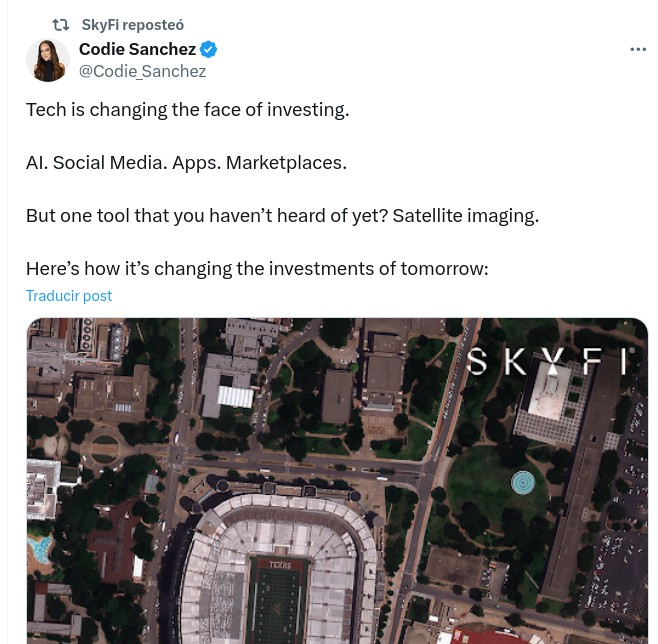

```{r setup, include=FALSE}
options(htmltools.dir.version = FALSE)
```

class: center, middle
background-image: url(img/fondo.jpg)

# Introducción a las tecnologías geoespaciales, entre ellas los SIG
## Conceptos básicos de SIG y datos geoespaciales
### *José Martínez*
### Universidad Autónoma de Santo Domingo (UASD)
#### 2025-02-06

---

```{r out.width='100%', fig.height=6, eval=require('leaflet')}
library(leaflet)
leaflet() %>%
  addProviderTiles(providers$Esri.WorldImagery,options = providerTileOptions(maxZoom = 21)) %>%
  leaflet::addMiniMap(width = 100, height = 100) %>%
  setView(lng = -69.91672150661316, lat = 18.45967067439675, zoom = 18) %>%
  addMarkers(lng = -69.91672150661316, lat = 18.45967067439675, popup = "FC-203", ) %>%
  leafem::addMouseCoordinates()
```

---

# ¿Qué son las Tecnologías Geoespaciales?

- Término **englobador** que agrupa un conjunto de herramientas, técnicas y sistemas para el **análisis y visualización de datos espaciales** ...

- ... que permiten capturar, almacenar, procesar y representar fenómenos geográficos, ...

- ... con infinidad de aplicaciones, como evaluación del riesgo de desastre, planificación urbana, monitoreo ambiental, agricultura de precisión, gestión de recursos, entre muchas otras.

---

## Algunos componentes

### **1. Sistemas de Información Geográfica (SIG)**
- Sistemas que incluyen datos geoespaciales, software, hardware, aplicaciones y personas, cuya misión es almacenar, analizar y visualizar datos espaciales.

### **2. Sensores Remotos (Teledetección)**
- Uso de imágenes satelitales y drones para monitoreo territorial.

### **3. Sistemas de Posicionamiento Global (GNSS)**
- Tecnologías como GNSS para obtener coordenadas precisas.

---

## Algunos componentes (cont.)

### **4. Métodos de análisis espacial**
- Fundamentalmente, algoritmos, modelos y técnicas para analizar datos espaciales.

### **5. Cartografía web/digital**
- Representación de información geográfica en mapas interactivos.

### **6. Inteligencia artificial aplicada a los datos geoespaciales, GeoAI, Big Data Geoespacial**
- Uso de IA y aprendizaje automático para analizar grandes volúmenes de datos espaciales.

---

## Importancia de las Tecnologías Geoespaciales

- Facilitan la **toma de decisiones** en diversas disciplinas.

- Mejoran la **gestión del territorio y los recursos naturales**.

- Son esenciales para **la innovación científica y tecnológica**.

---

## Herramientas y técnicas. "Geo-" hasta en la sopa

- **Cartografía**

- **Mapa**

- **Sistemas de información geográfica (SIG)**

- **Geomática**

- **Geoprocesamiento**

- **Geocomputación**

- **Teledetección**

- **Fotogrametría**

- **Observación de la Tierra**

- **Tecnología geoespacial**

---

## Herramientas y técnicas. "Geo-" hasta en la sopa (cont.)

- **Técnicas analíticas específicas de análisis de datos geoespaciales**
    1. Análisis de proximidad
    
    2. Análisis de superficies
    
    3. Análisis de redes
    
    4. __Estadísticas espaciales, análisis exploratorio de datos geoespaciales__
    
    5. **Modelización espacial** (vecindad, pesos espaciales, pruebas de autocorrelación espacial, ajuste de modelos para predecir o explorar asociación)
    
    6. **Interpolación y geoestadística** (técnicas de interpolación no geoestadísticas, variograma, técnicas de interpolación geoestadísticas-kriging-, predicción)

---

# Datos espaciales (o geospaciales) y espacio-temporales

- Los datos geoespaciales son datos con referencia geográfica (coordenadas referidas a un sistema)

- Los datos espaciales (o geoespaciales) y espacio-temporales **están en todas partes**.

- Se recogen de diversas fuentes y se presentan en múltiples formatos como televisión, periódicos, planificadores de rutas, pantallas de computadoras, dispositivos móviles y mapas en papel.

- Ejemplos: datos de censos, datos meteorológicos, datos de uso del suelo, imágenes satelitales.

---

## Modelos de datos geoespaciales

- Tradicionalmente, usábamos la distinción entre **ráster y vectorial**, pero actualmente, las cosas son algo más complicadas.

- De todas formas, antes de ver los datos "desde el lado de los SIG", veamos algunos conceptos básicos de sistemas de referencia.

---

## Sistemas y marcos de referencia, sistemas de coordenadas, datum, proyección

- Sistema de referencia. Definición teórica de un marco, donde se especifica cómo se determina el origen (centro de la Tierra), orientación (ejes), y las unidades (e.g. ITRS, WGS, SIRGAS).

- Marco de referencia: realización práctica de un marco de referencia (e.g. WGS84, ITRF14). Es un conjunto de convenciones y normas que definen cómo se mide y se representa la posición en la superficie terrestre, considerando los puntos anteriores. Se realiza por medio de un conjunto de puntos en el planeta de posición y velocidad conocidas, observaciones geodésicas (GPS, VLBI SLR y DORIS) y actualización.

---

## Sistemas y marcos de referencia, sistemas de coordenadas, datum, proyección (cont.)

- Tipo o sistema de coordenadas: utiliza el marco de referencia para proporcionar un método específico para localizar puntos en la Tierra (e.g. geográficas, proyectadas).

- Datum: proporciona la base matemática y física que el sistema de coordenadas utiliza para calcular posiciones precisas en el marco de referencia. En función de su definición

- Hay de dos tipos básicos de datums:
    - Locales: se definen mediante un elipsoide de referencia, su posición y un modelo de gravedad. Se intenta minimizar residuos haciendo pasar el elipsoide lo más del área de interés.
    - Globales: mediante el semieje mayor del elipsoide, la constante de gravitación, el coeficiente de forma dinámica y la velocidad angular de la Tierra.

---

## Sistemas y marcos de referencia, sistemas de coordenadas, datum, proyección (cont.)

- En función del plano de interés a medir, los datums se dividen en:
     - Horizontales, definen forma de la Tierra y una superficie de referencia desde la cual se miden las coordenadas horizontales (e.g. NAD27, WGS84 o "World Geodetic System 1984").
     - Verticales, elevación o altitud relativa a una superficie de referencia, como el nivel medio del mar (e.g. EGM96 o "Earth Gravitational Model 1996").
     
- Proyección: correspondencia biunívoca entre los puntos de la superficie terrestre y los puntos de un plano llamado "plano de proyección"

- Puedes aprender más, y hasta divertirte, aquí: ¿SIRGAS es una Pérdida de Tiempo? ¡Descubre por qué los Topógrafos No Pueden Vivir Sin Él!
https://www.youtube.com/watch?v=-gpif5Ex4vM

---

class: center, bottom
<div style="background-image: url(img/proyecciones.png); background-size: contain; background-position: center; background-repeat: no-repeat; height: 100%; width: 100%; position: absolute; top: 50%; left: 50%; transform: translate(-50%, -50%);">
</div>
Fuente: Olaya (2020)

---

## ¿Cómo ver un sistema de referencia en QGIS?

- En QGIS, el término elegido es "Sistema de Referencia de Coordenadas", para elegir el sistema de coordenadas. Esto incluye, de manera implícita, elegir una proyección y un Datum.

- Normalmente, puedes cambiar *on-the-fly* el SRC del lienzo.

- Para cambiar el SRC de una capa específica, necesitas realizar una operación a dicha capa, que forma parte de un ejercicio del curso.

- Hay varias formas para acceder a la definición del SRC, pero la más sencilla es usando el botón que simula un globo en la esquina inferior derecha.

- Elementos clave: ITRF, SIRGAS, WGS84, NAD27, EPSG:4326, EPSG:32619

---


## Cartografía

- Joly, 1988: arte de concebir, de trazar, de componer y de difundir los mapas

## Mapa

Joly, 1984: representación geométrica plana, simplificada y convencional, de toda la superficie terrestre o parte de ella, dentro de una relación de similitud  conveniente a la que llamamos escala

---

class: center, bottom
<div style="background-image: url(img/mapa-ejemplo.png); background-size: contain; background-position: center; background-repeat: no-repeat; height: 100%; width: 100%; position: absolute; top: 50%; left: 50%; transform: translate(-50%, -50%);">
</div>
Fuente: IGU (1967)

---

## Sistemas de información geográfica (SIG)

- Según Olaya (2020): un SIG es, fundamentalmente, una herramienta para trabajar con información georreferenciada. Hace pocos años se decía que un 70% de la información estaba georreferenciada.

- Ampliando: sistemas que incluyen datos geoespaciales, software, hardware, aplicaciones y personas, cuya misión es almacenar, analizar y visualizar datos espaciales.

- Un SIG no es meramente un programa de cartografía por ordenador, ni un software de tipo CAD.

---

class: center, bottom
<div style="background-image: url(img/sig1.png); background-size: contain; background-position: center; background-repeat: no-repeat; height: 100%; width: 100%; position: absolute; top: 50%; left: 50%; transform: translate(-50%, -50%);">
  Fuente: Olaya (2020)
</div>

---

class: center, bottom
<div style="background-image: url(img/sig2.png); background-size: contain; background-position: center; background-repeat: no-repeat; height: 100%; width: 100%; position: absolute; top: 50%; left: 50%; transform: translate(-50%, -50%);">
  Fuente: Olaya (2020)
</div>


---

## Cómo se representa el dato geoespacial, especialmente en los SIG

### <center>**"Las personas se pueden clasificar en dos tipos: las que les gustan los 'rásters' y las que les gustan los 'vectoriales'"**</center>

---
class: center, bottom
<div style="background-image: url(img/capas.jpg); background-size: contain; background-position: center; background-repeat: no-repeat; height: 100%; width: 100%; position: absolute; top: 50%; left: 50%; transform: translate(-50%, -50%);">
</div>
Fuente: Olaya (2020)

---

class: center, bottom
<div style="background-image: url(img/dimension-dato-geografico.jpg); background-size: contain; background-position: center; background-repeat: no-repeat; height: 100%; width: 100%; position: absolute; top: 50%; left: 50%; transform: translate(-50%, -50%);">
</div>
Fuente: Olaya (2020)

---

class: center, bottom
<div style="background-image: url(img/primitivas-geometrica.jpg); background-size: contain; background-position: center; background-repeat: no-repeat; height: 100%; width: 100%; position: absolute; top: 50%; left: 50%; transform: translate(-50%, -50%);">
</div>
Fuente: Olaya (2020)

---


class: center, bottom
<div style="background-image: url(img/representacion-raster-vectorial.jpg); background-size: contain; background-position: center; background-repeat: no-repeat; height: 100%; width: 100%; position: absolute; top: 50%; left: 50%; transform: translate(-50%, -50%);">
</div>
Fuente: Olaya (2020)

---


class: center, middle
background-image: url(img/fondo.jpg)

# Introducción a las tecnologías geoespaciales, entre ellas los SIG
## Breve historia y evolución de las tecnologías geoespaciales, incluyendo a los SIG y la observación de la Tierra (EO)
### *José Martínez*
### Universidad Autónoma de Santo Domingo (UASD)
#### 2025-02-06

---


### SIG y Observación de la Tierra (EO)

- EO: El proceso amplio (abarcador) de **recopilar información sobre la superficie, las aguas y la atmósfera de la Tierra** mediante plataformas de teledetección basadas en tierra, aéreas y/o satelitales.

- Retomando SIG: sistemas que incluyen datos geoespaciales, software, hardware, aplicaciones y personas, cuya misión es almacenar, analizar y visualizar datos espaciales.

---

class: center, bottom
<div style="background-image: url(img/onda-electromagnetica.jpg); background-size: contain; background-position: center; background-repeat: no-repeat; height: 100%; width: 100%; position: absolute; top: 50%; left: 50%; transform: translate(-50%, -50%);">
</div>
Fuente: Olaya (2020)

---

class: center, bottom
<div style="background-image: url(img/espectro-propiedades.png); background-size: contain; background-position: center; background-repeat: no-repeat; height: 100%; width: 100%; position: absolute; top: 50%; left: 50%; transform: translate(-50%, -50%);">
</div>
Fuente: Wikipedia

---

class: center, bottom
<div style="background-image: url(img/espectro.png); background-size: contain; background-position: center; background-repeat: no-repeat; height: 100%; width: 100%; position: absolute; top: 50%; left: 50%; transform: translate(-50%, -50%);">
</div>
Fuente: Wikipedia

---

class: center, bottom
<div style="background-image: url(img/ventanas-atmosfericas.png); background-size: contain; background-position: center; background-repeat: no-repeat; height: 100%; width: 100%; position: absolute; top: 50%; left: 50%; transform: translate(-50%, -50%);">
</div>
Fuente: Wikipedia

---


class: center, bottom
<div style="background-image: url(img/distintas-resoluciones.jpg); background-size: contain; background-position: center; background-repeat: no-repeat; height: 100%; width: 100%; position: absolute; top: 50%; left: 50%; transform: translate(-50%, -50%);">
</div>
Fuente: Olaya (2020)

---


class: center, bottom
<div style="background-image: url(img/resoluciones.jpeg); background-size: contain; background-position: center; background-repeat: no-repeat; height: 100%; width: 100%; position: absolute; top: 50%; left: 50%; transform: translate(-50%, -50%);">
</div>

---

class: center, bottom
<div style="background-image: url(img/13717_2020_255_Fig3_HTML.webp); background-size: contain; background-position: center; background-repeat: no-repeat; height: 100%; width: 100%; position: absolute; top: 50%; left: 50%; transform: translate(-50%, -50%);">
  Misiones de EO de NASA. Fuente: https://ecologicalprocesses.springeropen.com/articles/10.1186/s13717-020-00255-4/figures/3
</div>

---

class: center, bottom
<div style="background-image: url(img/ESA-developed_Earth_observation_missions.jpg); background-size: contain; background-position: center; background-repeat: no-repeat; height: 100%; width: 100%; position: absolute; top: 50%; left: 50%; transform: translate(-50%, -50%);">
  Misiones de EO de ESA. Fuente: https://www.esa.int/ESA_Multimedia/Images/2019/05/ESA-developed_Earth_observation_missions
</div>


---

class: center, bottom
background-image: url(img/GIS-evolution-and-future-trends.ppm)

- Evolución de los SIG. Fuente: https://www.researchgate.net/figure/GIS-evolution-and-future-trends_fig1_282724755

---

class: center, middle
background-image: url(img/fondo.jpg)

# Introducción a las tecnologías geoespaciales, entre ellas los SIG
## Aplicaciones de las tecnologías geoespaciales en diversas disciplinas
### *José Martínez*
### Universidad Autónoma de Santo Domingo (UASD)
#### 2025-02-06

---

## Algunas aplicaciones globales con computación en la nube

- Con **Google Earth Engine**: Plataforma de análisis geoespacial en la nube, que permite analizar grandes volúmenes de datos de forma rápida y eficiente.  URL: https://code.earthengine.google.com/

  - [Global Forest Change (Hansen et al.)](https://glad.earthengine.app/view/global-forest-change#bl=off;old=off;dl=1;lon=-70.57001390035545;lat=18.785291694943204;zoom=8;)
  
  - [Global Surface Water Explorer](https://global-surface-water.appspot.com/)
  
  - **El problema, realmente, es que hay muchos muchos muchos muchos más**.
  
- Con Microsoft Planetary Computer:

  - Microsoft Building Footprints, en el [Explorer del MPC](https://planetarycomputer.microsoft.com/explore?c=-69.9166%2C18.4603&z=15.87&v=2&d=ms-buildings&s=true%3A%3A100%3A%3Atrue&sr=desc&m=Global&r=Default) [GitHub](https://github.com/microsoft/GlobalMLBuildingFootprints/)

---

## Algunos ejemplos de servicios y aplicaciones con resoluciones muy altas

- Visitar: https://microsites.maxar.com/30cm/

- Visitar: https://apollomapping.com/

- Visitar: https://www.skyfi.com/

- Ver: https://x.com/Codie_Sanchez/status/1793274136573215191

<div style="text-align: center;">
  
</div>

---

class: center, bottom
<div style="background-image: url(img/gnss-diy-um980.jpg); background-size: contain; background-position: center; background-repeat: no-repeat; height: 100%; width: 100%; position: absolute; top: 50%; left: 50%; transform: translate(-50%, -50%);">
</div>

---

## Algunas aplicaciones locales

Selecciono algunas recientes:

- Selección de sitios para una red de estaciones meteoclimáticas en República Dominicana mediante estadística zonal de fuentes geoespaciales, análisis multicriterio y de vecindad. [Presentación en GitHub](https://geofis.github.io/seleccion-sitios-estaciones-meteoclimaticas-rd/presentaciones/III-Congreso-IDI-XXIII-JIC-nov24.html#/) [Preprint](https://eartharxiv.org/repository/view/8311/), repo de [GitHub](https://github.com/geofis/seleccion-sitios-estaciones-meteoclimaticas-rd)

- [Generación de un modelo digital del terreno en el Campus de la UASD utilizando receptores GNSS de bajo costo](https://geofis.github.io/mdt-campus-uasd-gnss-bajo-costo/presentaciones/III-Congreso-IDI-XXIII-JIC-nov24.html#/)

- Generación de red hidrográfica densa de República Dominicana a partir de modelo digital de elevaciones de resolución media. [Presentación de diapositivas](https://geofis.github.io/red-hidrografica-densa-rd/presentaciones/II-Congreso-IDI-XXII-JIC-nov23.html#/). [Preprint](https://doi.org/10.1590/SciELOPreprints.7056)

---

## Algunas aplicaciones locales (cont.)

- [Estadística zonal multipropósito sobre información geoespacial de República Dominicana, usando Google Earth Engine, Python y R](https://geofis.github.io/zonal-statistics/README.html)

- [Análisis de datos de precipitación del 18 de noviembre de 2023 en la ciudad de Santo Domingo](https://geofis.github.io/lluvias-noviembre-2023/analisis.html)

- Deforestación y fuego en República Dominicana durante el siglo XXI. [Presentación de diapositivas](https://geofis.github.io/forest-loss-fire-reproducible/index.html#/). [Artículo](https://doi.org/10.24072/pcjournal.157)

- [Medición de la deformación superficial en Santo Domingo usando tecnología GNSS](https://geofis.github.io/deformacion-superficial-SD-GNSS/index.html#/)

---

## Algunas aplicaciones locales (cont.)

- [Incendio de enero de 2022 en sierra de Bahoruco, República Dominicana](https://geofis.github.io/fuego-bahoruco-202201/README.html)

- [Gráficos, tablas y mapas de la Encuesta Nacional de Hogares de Propósitos Múltiples (ENHOGAR), 2021](https://geofis.github.io/enhogar-2021/README.html)

- [Coberturas del suelo del polígono núcleo del campus de la Universidad Autónoma de Santo Domingo (UASD) en su sede central](https://github.com/geofis/coberturas-suelo-uasd)

---

## Algunas aplicaciones locales (cont.)

- [Diseño de muestreo mediante índice espacial en Los Pilones / Los Boquerones para salida de campo](https://geofis.github.io/diseno-muestreo-los-pilones/README.html)

- [Áreas quemadas en el parque nacional José del Carmen Ramírez, marzo-abril 2023](https://geofis.github.io/fuego-jose-del-carmen-ramirez-2023/README.html)

- [Incendio forestal en Valle Nuevo, febrero-marzo de 2023](https://github.com/geofis/fuego-valle-nuevo-202302)

---

## Múltiples proyectos de hardware relacioandos con tecnologías geoespaciales.

- "Aire frugal".

- Tecnología GNSS de bajo costo ("RTK para todos"). Ya van 8, entre ellos la primera CORS de la UASD.

- Estaciones meteoclimáticas de bajo costo (SMA), en coordinación con Guakía Ambiente.

---

## Otras aplicaciones locales, recientes colaboraciones

Aunque no los puedo mostrar todos, porque son trabajos en curso y/o donde sólo colaboro, otras aplicaciones que puedo mencionar de las tecnologías geoespaciales en RD son las siguientes:

- Análisis espacial de la distribución de hormigas del parque Iberoamérica (Dahiana Guzmán).

- Análisis espacial de aerosoles en Santo Domingo y Punta Catalina usando computación en la nube y análisis espacio-temporal (Carime Matos).

- Análisis de bancas de apuestas en Mao, uf!, qué preocupante (Iván Ventura).

- Cambio superficial reciente de la lámina de agua de la laguna de Cabral usando Google Earth Engine y análisis espacio-temporal (Yoenny Urbáez).

---

## Otras aplicaciones locales, recientes colaboraciones (cont.)

  - Análisis hidromorfométrico por hidrología computacional del río Brujuelas y su entorno (Cinthia Vandepool).
  
  - Generación de modelos digitales del terreno por fotogrametría digital y posicionamiento preciso con tecnología GNSS para fines de modelización hidráulica en La Represa del río Isa (Esther Aquino) y río Maguá en Hato Mayor (Darihana Linares).
  
  - Análisis de la distribución y estado de salud de corales de la costa sur de República Dominican (Estefany Vargas).
  
  - ... mis disculpas a las demás personas que no menciono aquí ...

---

# Qué herramientas tienen QGIS y R para manejar datos ráster y vectoriales

## Bibliotecas GDAL/OGR, PROJ, GEOS

- [**GDAL/OGR**](https://github.com/OSGeo/gdal): C/C++, para lectura/escritura de datos raster y vectoriales.

- [**PROJ**](https://github.com/OSGeo/PROJ): C++, manejo de proyecciones y transformaciones cartográficas.

- [**GEOS**](https://github.com/libgeos/geos): C/C++ operaciones espaciales, geométricas y topológicas en datos vectoriales.

---

class: center, bottom
<div style="background-image: url(img/repo-zonal-statistics.png); background-size: contain; background-position: center; background-repeat: no-repeat; height: 100%; width: 100%; position: absolute; top: 50%; left: 50%; transform: translate(-50%, -50%);">
</div>

---

## ¿Cómo se usan en R y en QGIS?

- **R**: los paquetes `sf`, `stars`, `raster` y `terra` utilizan GDAL/OGR, PROJ, GEOS en todas sus operaciones, especialmente el primero.

- **QGIS**: Usa estas bibliotecas para cualquier operación de lectura, transformación e interoperabilidad de datos, tanto para raster como vectoriales.

---

# Paquetes en R

- Paquete `raster`

  - **Desarrollo y Soporte**: Paquete más antiguo.
  
  - **Funcionalidad**: Lectura, escritura, manipulación y análisis de datos raster.
  
  - **Limitaciones**: Manejo de grandes datos y rendimiento.
  
  - **Compatibilidad**: Amplia variedad de formatos a través de GDAL.

---

# Paquetes en R (cont.)

- Paquete `terra`
  - **Desarrollo y Soporte**: Sucesor moderno de `raster`.
  - **Funcionalidad**: Mejor manejo de grandes datos y rendimiento.
  - **Mejoras**: Supera limitaciones de `raster`, API similar.
  - **Compatibilidad**: Soporte GDAL.

- Paquete `stars`
  - **Desarrollo y Soporte**: Parte de tidyverse.
  - **Funcionalidad**: Manejo de datos raster y vectoriales, sintaxis tidyverse.
  - **Mejoras**: Datos multidimensionales (tiempo, bandas).
  - **Compatibilidad**: Integración con tidyverse, soporte de múltiples formatos.

---

# Referencias destacadas

Bivand, R. S., Pebesma, E., & Gómez-Rubio, V. (2013). Applied Spatial Data Analysis with R. Springer New York. https://doi.org/10.1007/978-1-4614-7618-4

Olaya, V. (2020). Sistemas de Información Geográfica. https://volaya.github.io/libro-sig/

Lovelace, R., Nowosad, J., & Muenchow, J. (2019). Geocomputation with R. Chapman and Hall/CRC. https://r.geocompx.org/

Dorman, M., Graser A., Nowosad, J. & Lovelace, R. (2019). Geocomputation with Python. Chapman and Hall/CRC. https://py.geocompx.org/
